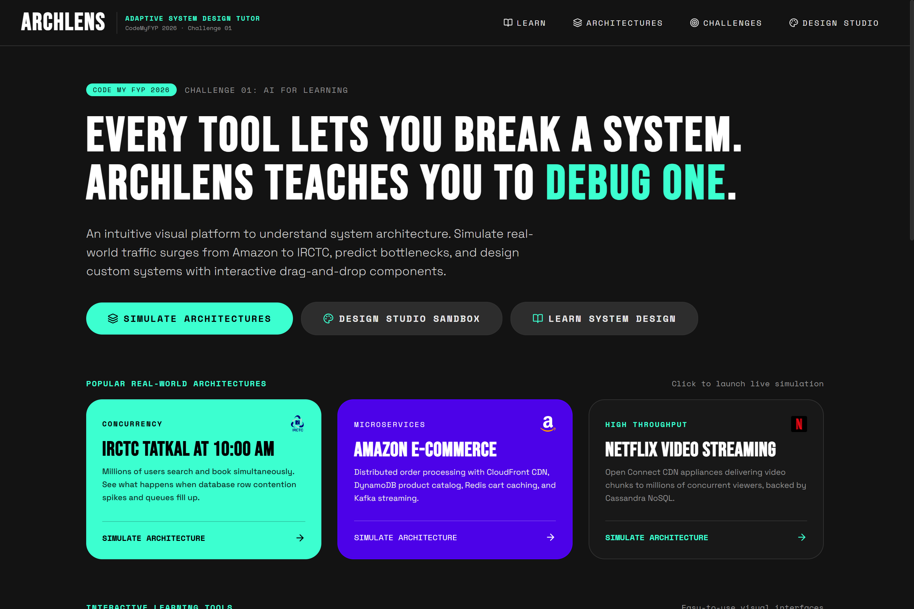
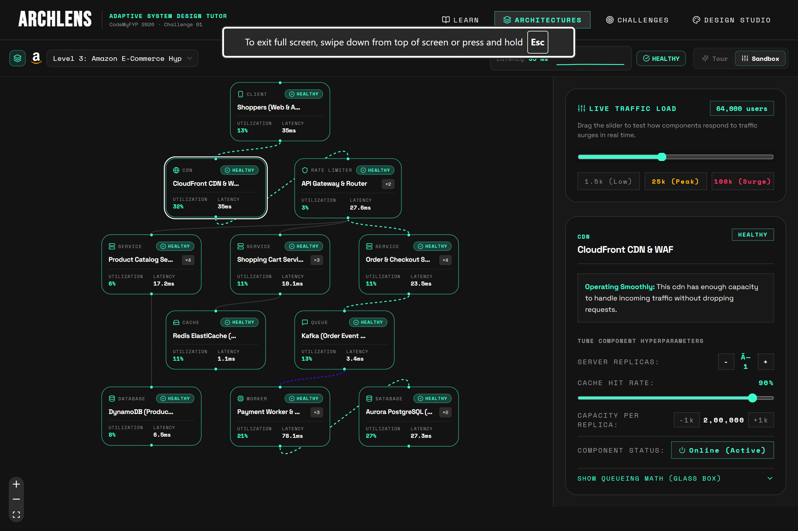

# ArchLens · Adaptive System Design & Incident Simulator

<p align="left">
  
  
  
  
  
  
</p>

> *"Every tool lets you break a system. ArchLens teaches you to **debug** one."*  
> **Challenge:** CodeMyFYP Hackathon 2026 · Challenge 01: AI for Learning  
> **Core Architecture:** Deterministic Simulation Engine (Ground Truth) + Responsible AI Mentor + The Verge Design System

<p align="center">
  
</p>

---

## Problem: System Design Has No Feedback Loop

Students and engineers prepare for system design by reading static articles or clicking around passive sandboxes (e.g., Paperdraw, SysSimulator). But passive sandboxes do not build intuition because:
1. **No Pre-Commitment:** Users flip toggles without predicting outcomes; being *wrong* about a prediction is what forces deep mental-model updates.
2. **AI Hallucinations:** Generic LLMs invent arbitrary numbers, hallucinate bottleneck causes, and lack mathematical grounding.
3. **No Realistic Debugging:** Sandboxes train people to trigger failures they already know about. Real engineering demands debugging: seeing degraded symptoms (surging latency, 5xx errors) and reasoning back to the root cause under uncertainty.

---

## System Architecture

ArchLens decouples the UI from a pure, mathematical simulation kernel and wraps the AI mentor behind strict, client-side numeric guardrails:

```mermaid
graph TD
    subgraph UI_Layer [User Interface & Presentation]
        Canvas["React Flow Topology Canvas (@xyflow/react)"]
        Inspector["Glass Box Inspector & Hyperparameter Tuning"]
        Audio["Voice AI Narrator (Web Speech API)"]
        Studio["Design Studio (Drag-and-Drop Sandbox)"]
    end

    subgraph State_Layer [Reactive State Layer]
        Store["Central Store (Zustand)"]
    end

    subgraph Core_Engine [Deterministic Ground Truth Engine (Pure TS)]
        Topo["Topological DAG Sorter & Cycle Detector"]
        Queue["M/M/1 Queuing Math & Utilization Engine"]
        Diff["State Delta Computer (Baseline vs Overrides)"]
        Grade["Deterministic Grader & SLO Evaluator"]
        Leitner["Leitner-Box Spaced Repetition Scheduler"]
    end

    subgraph Guardrails [Responsible AI & Guardrails Layer]
        LLM["AI Mentor (Groq / OpenAI Llama-3 / GPT-4)"]
        Validator["Numeric Validator (±2% StateDelta Tolerance)"]
        Spoiler["Spoiler Guard (Anti-Cheating Filter)"]
        Fallback["100% Offline Deterministic Templates"]
    end

    subgraph Content_Layer [Declarative Schemas & Data]
        Schemas["Runtime Zod Validation Schemas"]
        Blueprints["Production Blueprints (Tatkal, Amazon, Netflix, Cricket)"]
        Missions["Missions & Incident Scenarios"]
    end

    Canvas <--> Store
    Inspector <--> Store
    Studio <--> Store
    Audio <-- Store
    
    Store --> Topo
    Topo --> Queue
    Queue --> Diff
    Diff --> Grade
    Store --> Leitner

    Store --> LLM
    Diff --> Validator
    LLM --> Validator
    Validator -->|Pass| Store
    Validator -->|Fail or Offline| Fallback
    Fallback --> Store
    Spoiler --> LLM

    Schemas --> Blueprints
    Schemas --> Missions
    Blueprints --> Store
    Missions --> Store
```

---

## The ArchLens Solution

ArchLens is an adaptive system-design tutor powered by a **pure deterministic M/M/1 queueing simulator** paired with an **in-situ Responsible AI mentor**.

### 1. The 6-Step Pedagogical Loop
```
 ┌────────────┐   ┌────────────┐   ┌────────────┐   ┌────────────┐   ┌────────────┐
 │ 1. CONTEXT │──▶│ 2. PREDICT │──▶│ 3. BREAK / │──▶│ 4. EXPLAIN │──▶│  5. FIX    │
 │ Mission +  │   │ Student    │   │  OBSERVE   │   │ AI tutor,  │   │ Student    │
 │ system map │   │ commits an │   │ Engine runs│   │ grounded   │   │ adds a     │
 │            │   │ answer     │   │ animation  │   │ in engine  │   │ component, │
 └────────────┘   └────────────┘   └────────────┘   │ output,    │   │ re-runs,   │
       ▲                                            │ Socratic   │   │ must pass  │
       │                                            └────────────┘   └─────┬──────┘
       └──────────── 6. MASTERY MAP updates, next mission adapts ◀─────────┘
```

### 2. Incident Mode (Real-World On-Call Simulation)
Inverts the learning loop:
- **Fog of War:** All nodes start in a neutral grey uninspected state during a live production crisis.
- **Inspection Budget:** The student has a limited budget (5 inspections) to interrogate node telemetry.
- **Root Cause Diagnosis:** Student submits their diagnosis (`{ rootCauseNode, causeType }`).
- **Post-Mortem Cascade:** Replays the chronological failure propagation across upstream and downstream dependencies.

### 3. Guided Architecture Walkthroughs (Interactive Level Tours)
To bridge the gap before running high-stress simulations, each architecture includes a step-by-step interactive tour:
- **Spotlight Navigation:** Highlights relevant nodes and data paths at each stage (e.g., Edge Ingress -> API Gateway -> Microservices -> Cache/Broker -> Primary DB).
- **Stage Explanations:** Explains the engineering rationale, failover strategies, and bottleneck risks at each layer.
- **Audio Narration Support:** Integrates directly with voice narration for audio-guided learning.

### 4. Design Studio (Drag-and-Drop Architecture Sandbox)
A full-featured visual architecture editor allowing learners and system architects to:
- **Start from Scratch or Templates:** Build custom topologies from a blank canvas or jumpstart from industry templates.
- **Node Library:** Drag and drop clients, reverse proxies, microservices, distributed caches, event brokers, and relational/document databases.
- **Real-Time Traffic Tuning:** Adjust concurrent user load (RPS) via interactive sliders and immediately watch M/M/1 queuing math calculate per-node utilization, latency spikes, and packet drop rates.
- **Dynamic Wiring:** Connect source and target handles with real-time cycle detection and topological validation.

### 5. Voice AI Narration (Web Speech API)
- Hands-free Socratic mentorship powered by native speech synthesis (`speechNarrator.ts`).
- Spoken briefings during high-intensity incident simulations and real-time audio guidance through tutor explanations.
- Complete playback controls (play, pause, resume, cancel) and speech rate/pitch options.

### 6. Glass Box Mathematical Transparency
Unlike black-box simulators, the **Glass Box** inspector displays the exact M/M/1 queueing theory equations for any selected node:
- **Traffic Intensity:**
  $$\rho = \frac{\lambda}{c \cdot \mu}$$
  *(where $\lambda$ is arrival rate, $\mu$ is service rate per replica, and $c$ is replica count)*
- **Service Response Time (Queueing + Execution):**
  $$W = \frac{1}{\mu - (\lambda / c)} + W_{\text{base}}$$
- **Drop Probability Under Saturation ($\rho > 1$):**
  $$P_{\text{drop}} = \max\left(0, 1 - \frac{1}{\rho}\right)$$

### 7. Spaced Retention & Daily Incident
- 90-second incident variant targeting the learner's weakest concept.
- Powered by a Leitner-box spaced repetition algorithm persisted in `localStorage`.

### 8. System Design Knowledge Base & Component Catalog
- **Interactive Theory Hub:** Comprehensive learning modules covering Horizontal vs. Vertical Scaling, CAP Theorem, Database Sharding, Caching Topologies, and Message Queuing.
- **Component Catalog:** Deep-dive cards detailing operational characteristics, failure modes, latency baselines, and architectural tradeoffs for each infrastructure component.

---

## Authentic Industry Blueprints & Brand System

ArchLens features realistic topologies with authentic SVG company assets (`CompanyLogo.tsx`):
1. **IRCTC Tatkal at 10 AM** (`tatkal.json`): 11-node architecture modeling the extreme 10 AM ticket surge, CDN bypass, Redis seat cache eviction, database bottleneck, and payment gateway fanout.
2. **The Final Over (Live Cricket Streaming)** (`cricket.json`): 11-node architecture modeling CDN edge delivery, video segment transcoders, session cache stampede, and telemetry decoupling.
3. **Amazon E-Commerce Hyperscale**: Microservice architecture handling lightning deals, inventory reservation, asynchronous cart checkout, and distributed database locking.
4. **Netflix Video Streaming**: Global CDN distribution with edge compute, origin video transcoding pipelines, and user recommendation caches.
5. **Authentic Vector Brand Library**: Integrated SVG marks for Amazon, Netflix, IRCTC, Hotstar, Redis, Apache Kafka, Stripe, Uber, Airbnb, Cloudflare, Discord, GitHub, LinkedIn, X, and YouTube.

### Blueprint Showcase: Amazon E-Commerce Hyperscale
*Interactive dynamic simulation showing real-time traffic surge, node utilization, latency spikes, and hyperparameter tuning across an 11-node microservices topology.*

<p align="center">
  
</p>

---

## Responsible AI & Guardrails (Ground Truth Guarantee)

Judges evaluate Responsible AI rigorously (15% of score). ArchLens enforces non-negotiable defensive constraints:
- **Strict Grounding:** The deterministic simulation engine is the sole source of truth. The AI may only explain what the engine computes.
- **Client-Side Numeric Validator (`validate.ts`):** Every number in the LLM response must match the engine's `StateDelta` within $\pm 2\%$ relative tolerance, and all referenced node IDs must exist in the active graph.
- **Spoiler Guard (`spoilerGuard.ts`):** Scans candidate mentor responses to strictly prohibit revealing root causes before diagnosis submission.
- **100% Offline Deterministic Fallback (`templates.ts`):** If the LLM API is unavailable, unconfigured, or fails validation, deterministic templates provide instant, verified feedback marked with `[template fallback]`.

---

## Comparison with Existing Tools

| Feature | Paperdraw / SysSimulator | Generic AI Tutors | ArchLens |
|---|---|---|---|
| **Simulation Truth** | Deterministic / Heuristic | Hallucinates numbers | **Deterministic M/M/1 Engine** |
| **Predict-Before-Seeing** | No (Passive Sandbox) | No | **Yes (Mandatory Structured Prediction)** |
| **Incident Mode** | No | No | **Yes (Fog of War + Inspection Budget)** |
| **Guided Architecture Tours** | No | No | **Yes (Multi-Step Node Highlighting)** |
| **Custom Sandbox / Canvas** | Partial | No | **Yes (Blank Canvas + Drag-and-Drop + Live Sim)** |
| **Voice AI Narration** | No | No | **Yes (Integrated Speech Synthesis)** |
| **Formula Transparency** | Hidden | No | **Yes (Glass Box Panel)** |
| **AI Grounding Guardrails** | No AI | Unchecked | **Yes (±2% Delta Validator + Spoiler Guard)** |
| **Spaced Repetition** | No | No | **Yes (Leitner-Box Daily Incidents)** |
| **Works Offline / No Key** | Yes | Fails | **Yes (100% Deterministic Fallback)** |

---

## Codebase Architecture & Modularity

The codebase is strictly modularized with clean domain separation:

```
src/
├── engine/              # Pure TypeScript M/M/1 simulation engine (0 UI dependencies)
│   ├── simulate.ts      # Core simulation runner
│   ├── topology.ts      # Topological DAG sorting & cycle detection
│   ├── nodeModels.ts    # Queueing theory math for each node type
│   ├── diff.ts          # State delta computation (before vs after)
│   ├── grade.ts         # Graders for predictions and incident diagnosis
│   └── scheduler.ts     # Leitner-box spaced repetition algorithm
├── tutor/               # Responsible AI mentor & defensive guardrails
│   ├── tutorClient.ts   # Multi-provider client (Groq / OpenAI)
│   ├── validate.ts      # Client-side ±2% numeric verification
│   ├── spoilerGuard.ts  # Anti-cheat spoiler detection filter
│   └── templates.ts     # 100% offline verified fallback responses
├── content/             # Declarative system architectures & missions
│   ├── blueprints/      # JSON topologies (tatkal, cricket, amazon, netflix)
│   ├── missions/        # Predict-Break-Fix guided missions
│   ├── incidents/       # Fog-of-War incident scenarios
│   └── schemas.ts       # Runtime Zod validation schemas
├── features/            # Feature-sliced UI components
│   ├── architectures/   # Preset explorer & guided stage tours
│   ├── studio/          # Design Studio sandbox builder
│   ├── canvas/          # Interactive React Flow node canvas
│   ├── glassbox/        # Queueing theory math inspector panel
│   ├── incident/        # Production incident player & post-mortem
│   ├── mission/         # 6-step guided mission player
│   ├── mastery/         # Spaced retention mastery dashboard
│   ├── landing/         # Verge landing page & interactive loop
│   └── learn/           # System design concept hub & component catalog
├── store/               # Central reactive state management
│   └── useArchStore.ts  # Zustand store with selector-based subscriptions
└── utils/               # Shared cross-cutting utilities
    └── speechNarrator.ts # Web Speech API synthesizer
```

---

## Tech Stack & Engineering Standards

- **Runtime & Language:** TypeScript 5.x (Strict mode: `noImplicitAny`, `strictNullChecks`, `noUncheckedIndexedAccess`)
- **UI & Framework:** React 18/19, Vite, Tailwind CSS (The Verge 2024 Design System tokens)
- **Canvas / Topology:** `@xyflow/react` (React Flow v12) with custom nodes & SVG particle streams
- **State Management:** Zustand (selector-based subscriptions)
- **Validation:** Zod (runtime validation for graphs, missions, incidents, API envelopes)
- **Unit Testing:** Vitest (29 tests covering engine math, topological sorting, Leitner scheduler, and guardrails)

---

## Quick Start & Local Setup

### 1. Clone & Install
```bash
git clone https://github.com/Dilraj07/CodeYourFYP.git
cd CodeYourFYP
npm install
```

### 2. Environment Configuration (Optional)
ArchLens functions 100% offline out-of-the-box using deterministic templates. To enable the live AI tutor:
```bash
cp .env.example .env
# Add your GROQ_API_KEY or OPENAI_API_KEY in .env
```

### 3. Run Development Server
```bash
npm run dev
# Opens at http://localhost:5173
```

### 4. Run Test Suite
```bash
npm test
# 29 passed (engine math, cycle detection, Leitner scheduling, guardrails)
```

### 5. Production Build
```bash
npm run build
# Compiles TypeScript and bundles production assets via Vite
```

---

## Hackathon Evaluation Alignment (Challenge 01: AI for Learning)

| Hackathon Criterion | ArchLens Implementation |
|---|---|
| **Responsible AI (15%)** | Non-negotiable client-side verification (`validate.ts`). The LLM is never trusted with numbers; answers deviating $> 2\%$ from the deterministic engine are rejected. `spoilerGuard.ts` prevents revealing root causes before student diagnosis. |
| **Pedagogical Innovation** | Predict-Before-Seeing loop forces cognitive commitment. Incident mode with Fog-of-War and inspection budgets trains realistic root-cause debugging under uncertainty. |
| **Mathematical Grounding** | Replaces black-box guessing with authentic M/M/1 queuing theory formulas ($\lambda, \mu, \rho$, latency, drops) visible in the Glass Box panel. |
| **Offline Resilience** | Zero mandatory cloud dependencies. Fully offline-capable via deterministic template fallbacks. |
| **Technical Polish** | Zero-error strict TypeScript, 29 passing Vitest tests, The Verge 2024 design system, and authentic SVG company brand assets. |

---

## Authors & Acknowledgments

- **Author:** Dilraj ([@Dilraj07](https://github.com/Dilraj07))
- **Hackathon:** CodeMyFYP Hackathon 2026
- **Real-World Citations:** See [`docs/sources.md`](./docs/sources.md) for public engineering sources behind IRCTC and cricket streaming blueprints.
